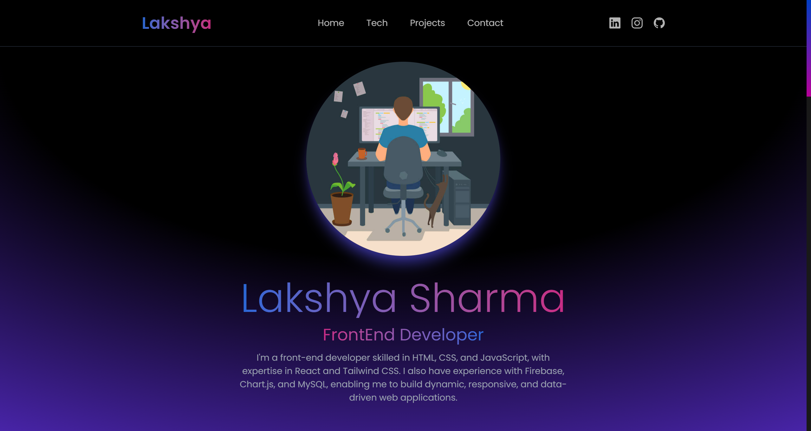

# Portfolio Website

A sleek and modern personal portfolio website built using React, Tailwind CSS, and EmailJS for contact form functionality.

## 🚀 Features

- **Hero Section** – Showcases your name, title, and a short bio.
- **Navigation Bar** – Smooth scrolling between sections.
- **Projects Section** – Displays projects with descriptions and technologies used.
- **Contact Section** – Users can send messages via EmailJS.
- **Responsive Design** – Fully optimized for all screen sizes.

## 🛠️ Tech Stack

- **Frontend:** React, Tailwind CSS, Framer Motion
- **Backend:** N/A (Uses EmailJS for contact form)
- **Tools & Libraries:** EmailJS, React Icons

## 📦 Installation

1. Clone the repository:

   ```sh
   git clone https://github.com/slakshya-22/portfolio.git
   cd portfolio

## 🖼️ Screenshot

